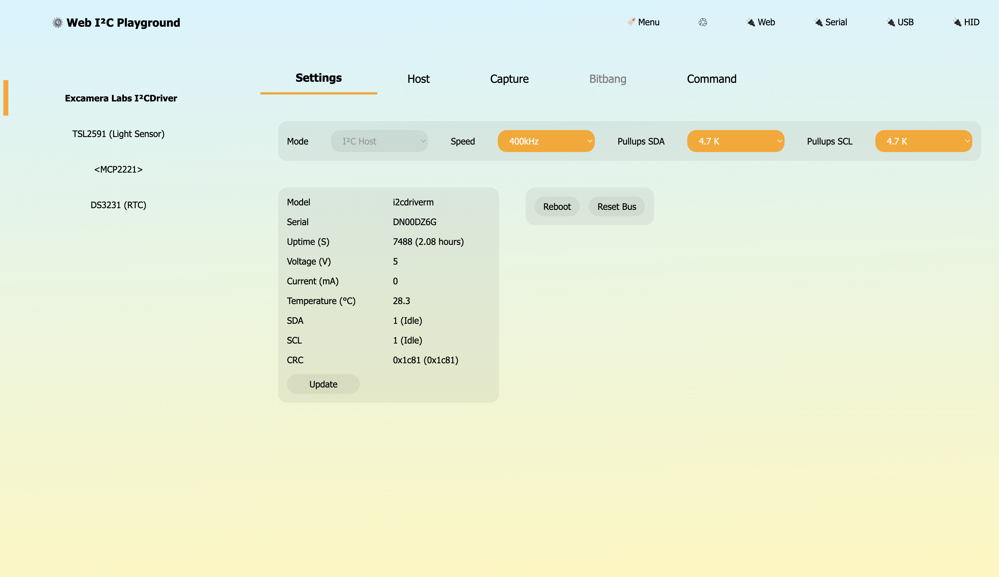
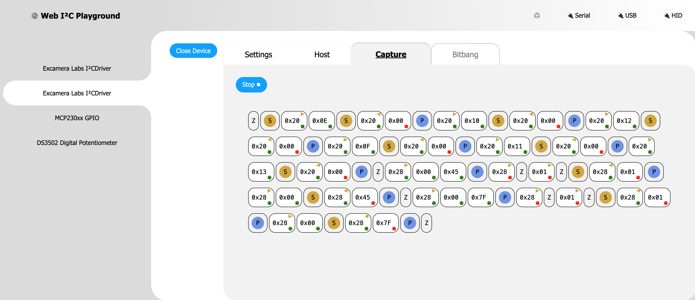
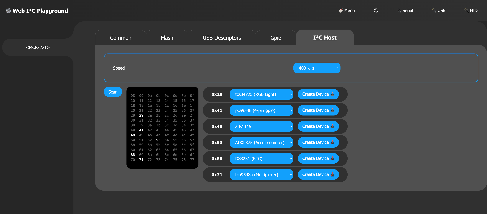
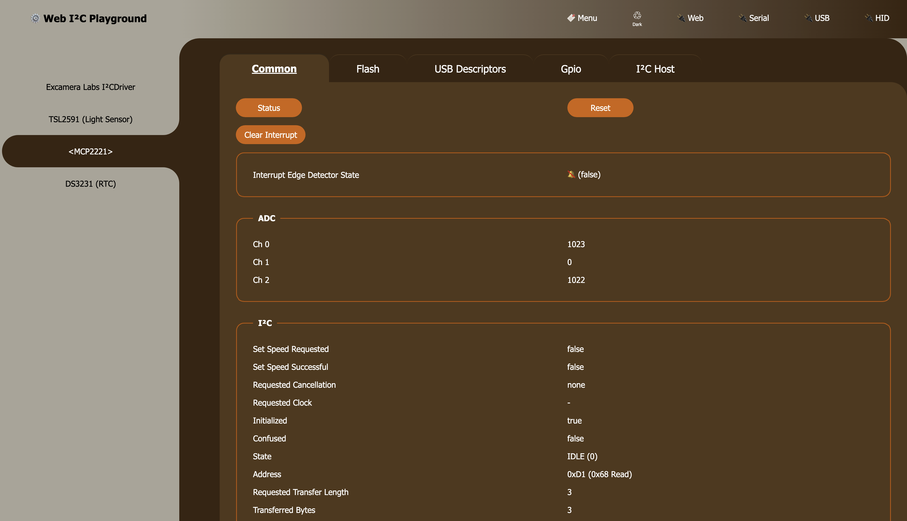
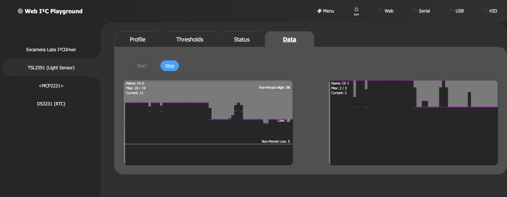

# Device Playground

A Web Application providing comprehensive access to I²C Bus devices. Running fully in the browser via Web Technologies (WebHID / SerialPort / ArrayBuffers etc)

Note: Chrome is recommended.

## Bridging Browser to I²C Bus

In order to bridge I²C into the browsers environment, several devices can be used:

- [ExCamera i2cDriver](https://github.com/johntalton/i2c-bus-excamera-i2cdriver) (SerialPort)
- [MCP2221](https://github.com/johntalton/i2c-bus-mcp2221) (WebHID)
- [I2CBusService](https://github.com/johntalton/i2c-bus-service) (REST API)

Each of these devices support the `I2CBus` abstraction interface provided by [AOD](https://github.com/johntalton/and-other-delights) and makes extensive use of modern `ArrayBuffer`.

Both drivers and bridges are fully isomorphic code supporting this native webapp and nodejs environments.

## Action Shots

### ExCamera Driver Basic Information screen

### Using the ExCamera I2CDriver to Capture Bus traffic:

### Scanning the MCP2221 Bus for attached devices

### MCP2221 Information Page

### Viewing Light Levels with attached TSL2591

## Virtual Buses

The [I2CBus-TCA9548](https://github.com/johntalton/i2c-bus-tca9548a) is a similar `I2CBus` implementation.  It can provide auto-magic channel management of he TCA9548 device.

The above mentioned I2CBus-Service provides a REST API client that exposes a `I2CBus` into the browser.  The service itself can be setup to use *all* of the listed bridges above.

## NodeJS

NodeJS (on devices like a Raspberry PI) can access the native Linux I²C Bus.  A common implantation for this is [`i2c-bus`](https://github.com/fivdi/i2c-bus) library.

In order to make it compatible with AOD `I2CBus` API the adapter has been provided [I2CBusFivdi](https://github.com/johntalton/i2c-bus-fivdi).

This can be used withing the `I2CBuService` or standalone in order to use AOD compatible devices.

## Custom Address

While the bridges support a `scan` mode screen, they also provide adding devices manually from a custom address.  This can be useful when using devices such as the LTC4316 which can shift the address of a device, or when underlying bridge scans are not desired or able to find the device specified.

## Devices

Many devices are supported natively:

Temperature:
- [AHT20](https://github.com/johntalton/aht20)
- [ADT7410](https://github.com/johntalton/adt7410)
- [AM2330](https://github.com/johntalton/am2320)
- [Bosch IEU](https://github.com/johntalton/boschIEU)

GPIO Expander
- [MC23XXX](https://github.com/johntalton/mcp23)
- [PCF8574](https://github.com/johntalton/pcf8574)
- [PCA9536](https://github.com/johntalton/pca9536)
- [AW9523](https://github.com/johntalton/aw9523)

Segment Display
- [HT16K33](https://github.com/johntalton/ht16k33)

Real-Time Clock
- [DS3231](https://github.com/johntalton/ds3231)
- [PCF8523](https://github.com/johntalton/pcf8523)

RFID / NFC
- [ST25DV](https://github.com/johntalton/st25dv)

Accelerometer / Magnetometer
- [ADXl375](https://github.com/johntalton/adxl375)

Current / Voltage
- [INA219](https://github.com/johntalton/ina219)

I²C Multiplexer
- [TCA9548](https://github.com/johntalton/tca9548a)

Potentiometer
- [DS1841](https://github.com/johntalton/ds1841)
- [DS3502](https://github.com/johntalton/ds3502)

Analog to Digital
- [MCP300X](https://github.com/johntalton/mcp300X)

Light
- [TCS34725](https://github.com/johntalton/tcs34725)
- [TSL2591](https://github.com/johntalton/tsl2591)

LED
- [SSD1306](https://github.com/johntalton/ssd1306)

Haptic Feedback
- [DRV2605](https://github.com/johntalton/drv2605)